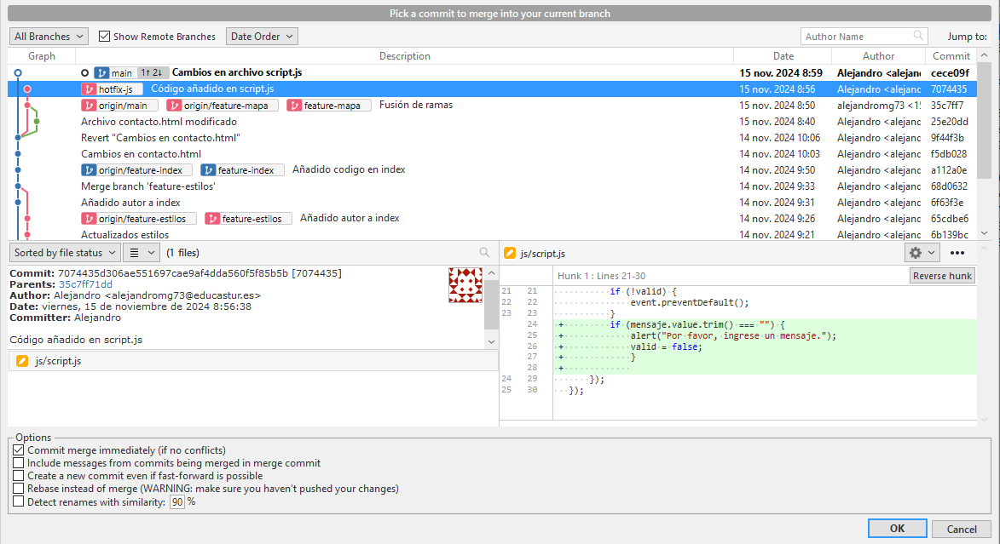

# TAREA GIT

> Despliegue de Aplicaciones Web: GIT
>
> Alejandro Miranda García

[TOC]

<u>URL Repositorio GITHUB</u>: https://github.com/alejandromg73/labowebs


### Trabajo en local

1.  **Inicializa un nuevo repositorio Git en una carpeta llamada `"labowebs"` y agrega los archivos proporcionados en el aula virtual. Renombra la rama master a main , si es necesario. Realiza el primer commit. Muestra el log del repositorio.**

​	Creo la carpeta `labowebs` en Documentos e inicializo el repositorio:

```bash
git init
```

La rama master ya se llama `main`: 


Hago el commit y muestro el log:


```bash
git log --all --decorate --oneline --graph
```


2.  **Incluye un fichero .gitignore para que los ficheros README.md , LICENCE.txt y passwords.txt sean ignorados por el control de versiones. Realiza el commit y muestra los logs del repositorio en una línea.**

   ```bash
   touch .gitignore
   ```

   

   Hago el commit y muestro los logs del repositorio

   

   

El archivo .gitignore incluye: 


3. **En el repositorio, crea los archivos README.md , LICENCE.txt y passwords.txt con algún contenido. Muestra el estado del repositorio. Muestra el listado de archivos ignorados.**

   

   Muestro el estado del repositorio con git status:

   ```bash
   git status
   ```

   

   Muestro el listado de archivos ignorados con 

   ```bash
   git status --ignored
   ```

   

   

4. **Crea una rama feature-estilos . Cámbiate a ella. Modifica el archivo estilos.css : propiedad color del body y de h2 : #2a2a2a propiedad background-color de header y footer: #2a75ff**

   **Comprueba el estado del repositorio. Añade los cambios, realiza un commit con el mensaje "actualizados estilos a azules"**

   Creo una rama con

   ```bash
    git branch feature-estilos
   ```

   

   Me cambio a esa rama con

   ```bash
    git checkout feature-estilos
   ```

   

   Cambio el color del body y del h2 a: \#2a2a1a, y el background-color de header y footer a \#2a75fa

   Tras los cambios, muestro el estado del repositorio para ver los cambios pendientes y hago commit de los cambios:

   

   

   5**. Vuelve a la rama main . En el archivo index.html añade un comentario donde se indique tu nombre como autor de la página. Comprueba el estado del repositorio. Añade los cambios, realiza un commit con el mensaje ' añadido autor en index'. Muestra los logs del repositorio en una línea, gráficamente y con 'decoración'**

   Vuelvo a la rama main con 

   ```bash
   git checkout main
   ```

   Añado un comentario en index con mi nombre

   

   Compruebo estado repositorio y hago commit con el mensaje indicado:

   

   Muestro logs del repositorio:

   ```bash
   git log --all --decorate --oneline --graph
   ```

   

   

   6.**Fusiona la rama feature-estilos en la rama main. Muestra los logs del repositorio en una línea, gráficamente y con 'decoración'**

Fusiono la rama feature-estilos en la rama main con el comando

```bash
git merge feature-estilos
```

Muestro logs como siempre:


### Trabajo remoto

1. **Continúa con el repositorio labowebs . Añade el repositorio a Sourcetree.** 

   Añadido repositorio a Sourcetree: 

   

2. **Crea un repositorio remoto y sube al remoto los ficheros de tu repositorio local. Debes subir todas las ramas.** 

   Creo el repositorio remoto y subo los ficheros del local (las dos ramas que tengo)

   


Todo correcto


3. **Crea una rama feature-index. Añade el siguiente código dentro de la section class about, añade los cambios y crea un commit. Sube los cambios al remoto.**

   Creo la rama: 

   

   Hago el commit:

   

   Subo los cambios al remoto, hago un push y compruebo desde el remoto que se ha subido: 

   

   

4. **En el repositorio local, fusiona la rama feature-index en la rama main .**

   Fusiono la rama en main:

    

   Hago un push para subir los nuevos cambios al remoto

   

5. **Edita el fichero contacto.html . Borra unas líneas. Muestra los ficheros con cambios pendientes y las diferencias. Añade los cambios y haz un commit.**

   Borré esta linea:     

   ```bash
     <button type="submit">Enviar</button> 
   ```

   Que es el botón de enviar

   Fichero con cambios pendientes y sus diferencias:

   

   Añado los cambios y hago un commit:

   

   

6. **Te das cuenta del error. Deshaz el commit anterior. Captura el estado actual del repositorio.** 

   Para deshacer el commit, doy click en el commit y doy a reverse commit.

   

   

7. **Crea una rama feature-mapa . Incluye este código en el archivo contacto.html . Añade los cambios. Realiza un commit. Sube los cambios al remoto. Muestra en el remoto los cambios del archivo contacto.html en la rama feature-mapa.**

   Creo la rama y me cambio a ella


Incluyo el código en el archivo contacto.html, añado los cambios, y realizo commit


Hago un push para sincronizarlo con el repositorio remoto y compruebo que se ha realizado en la nueva rama:


Muestro los cambios en el remoto del archivo contacto.html:


8. **En GitHub, en la rama main , fusiona la rama feature-mapa . Baja los cambios del remoto a local. Deja los dos repositorios sincronizados.**

Para fusionar las dos ramas en GitHub, creo una pullrequest, desde la rama main, que es a la cual le quiero fusionar la rama feature-mapa


Una vez tengo ya el pull request, le doy a merge pull request para fusionar ambas ramas:


Le doy a confirmar la fusión:


Todo correcto:


Hago un pull desde Sourcetree para traerme los cambios del remoto al local: 

Listo:


### Conflictos

1. **Crea una rama hotfix-js . Cámbiate a ella. Añade este código en el fichero script.js . Confirma el cambio y haz un commit. (Fíjate en los números de línea...)**

   Creo la rama:

   

   

   Añado el código en el fichero script.js en las líneas 24-27

   

   Hago commit:

   

   

2. **Vuelve a la rama main . En el fichero script.js en las mismas líneas que en la cuestión anterior, añade el código siguiente. Confirma el cambio y haz un commit.**

   Vuelvo a la rama main y modifico las mismas líneas que hice en la otra rama:

   

   Hago commit:

   

   

3. **Fusiona la rama hotfix-js en main . Debe producirse un conflicto. Resuélvelo. Cuando termines la resolución del conflicto sube los cambios al remoto - Deja los repositorios sincronizados -**

​	Fusiono hotfix-js en main para producir un conflicto:



Se ha producido un conflicto, doy click derecho en el archivo y selecciono "Resolve conflict":


Resuelvo los cambios del conflicto mediante la herramienta gráfica de Sourcetree y subo los cambios al remoto:


Hago un push y compruebo en el remoto si han quedado sincronizados:


Todo correcto, tanto el repositorio local como el remoto, quedan sincronizados


###  Subida de documentación

Incluyo en la carpeta `docs`:

- Fichero markdown
- Carpeta con imágenes
- PDF

